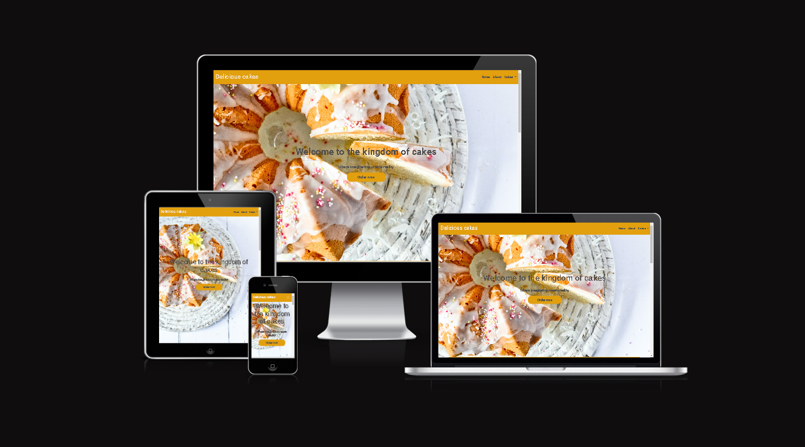
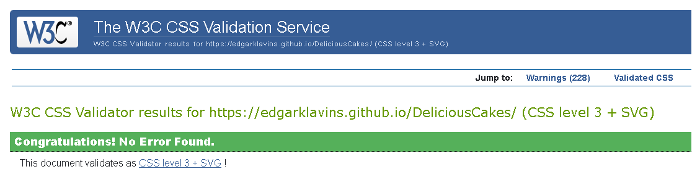
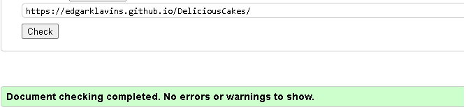
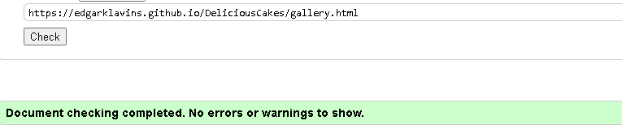
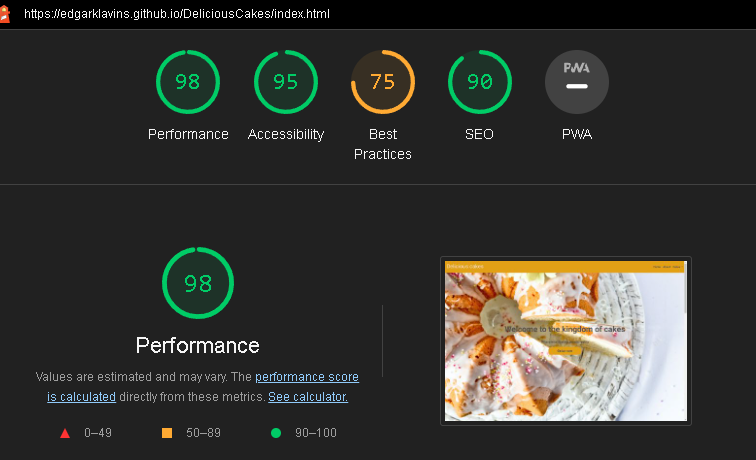

# Welcome to my first web page "Delicious Cakes"

## Milestone Project 1 - Static Front-End Website

###  I have created this web page as a part of  my Milestone Project 1 submission. All names and addreses are not real.
 

## Live Project

[My live project](https://edgarklavins.github.io/DeliciousCakes/)
 

## Repository
[My repository](https://github.com/EdgarKlavins/DeliciousCakes)

# Technologies Used

## Languages used
<ul>
<li>HTML5</li>
<li>CSS3</li>
</ul>

## Frameworks, Libraries & Programs Used

<ul>
<li><strong>Bootstrap 5.0.2</strong></li>
(Bootstrap was used to assist with the responsiveness and styling of the website.)
<li><strong>Hover.css</strong></li>
(Hover was used for navigation bar and jambotron elements)
<li><strong>Google Fonts</strong></li>
Google fonts were used to import the 'Roboto' font into the style.css file which is used on all pages throughout the project.
<li><strong>Font Awesome</strong></li>
Font Awesome was used on all pages throughout the website to add icons for aesthetic and UX purposes.
<li><strong>jQuery</strong></li>
Query came with Bootstrap to make the navbar responsive but was also used for the smooth scroll function in JavaScript.
<li><strong>Git</strong></li>
Git was used for version control by utilizing the Gitpod terminal to commit to Git and Push to GitHub.
<li><strong>Github</strong></li>
GitHub is used to store the projects code after being pushed from Git.
<li><strong>Photoshop</strong></li>
Photoshop was used for resizing images and editing photos for the website.

</ul>
 

## Design
### Colour Scheme
The two main colours used are orange rgb(226, 159, 14) and grey #525050 

### Typography
The Roboto font is the main font used throughout the whole website with Sans Serif as the fallback font in case for any reason the font isn't being imported into the site correctly.
### Imagery
Imagery is important. The large, background hero image is designed to be striking and catch the user's attention. It also has a modern and energetic 

Most of images are takken from 
Unsplash: https://unsplash.com

## Testing

### W3C CSS Validator
 

    

 

 

### W3C HTML Validator

#### Home page

 

#### Gallery

 

### Lighthouse

 

# Deployment

## GitHub Pages
The project was deployed to GitHub Pages using the following steps...

<OL><li>Log in to GitHub and locate the GitHub Repository</li>
<li>At the top of the Repository (not top of page), locate the "Settings" Button on the menu.</li>

<li>Scroll down the Settings page until you locate the "GitHub Pages" Section.</li>
<li>Under "Source", click the dropdown called "None" and select "Master Branch".</li>
<li>The page will automatically refresh.</li>
<li>Scroll back down through the page to locate the now published site link in the "GitHub Pages" section.</li>
</OL>
 

## Forking the GitHub Repository
By forking the GitHub Repository we make a copy of the original repository on our GitHub account to view and/or make changes without affecting the original repository by using the following steps...
<ol>
<li>Log in to GitHub and locate the GitHub Repository</li>
<li>At the top of the Repository (not top of page) just above the "Settings" Button on the menu, locate the "Fork" Button.</li>
<li>You should now have a copy of the original repository in your GitHub account.</li></ol>

## Making a Local Clone
<ol><li>Log in to GitHub and locate the GitHub Repository</li>
<li>Under the repository name, click "Clone or download".</li>
<li>To clone the repository using HTTPS, under "Clone with HTTPS", copy the link.</li>
<li>Open Git Bash</li>
<li>Change the current working directory to the location where you want the cloned directory to be made.</li>
<li>Type git clone, and then paste the URL you copied in Step 3.</li>
 

> $ git clone https://github.com/YOUR-USERNAME/YOUR-REPOSITORY
<li>Press Enter. Your local clone will be created.</li>
 

> Cloning into `CI-Clone`...

> remote: Counting objects: 10, done.

> remote: Compressing objects: 100% (8/8), done.

> remove: Total 10 (delta 1), reused 10 (delta 1)

> Unpacking objects: 100% (10/10), done.

</ol>

 

## Acknowledgements

Thanks to Code institute and Bristol College for their support.