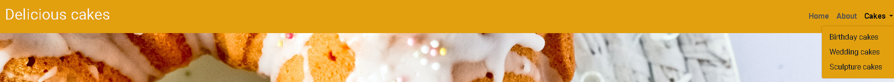
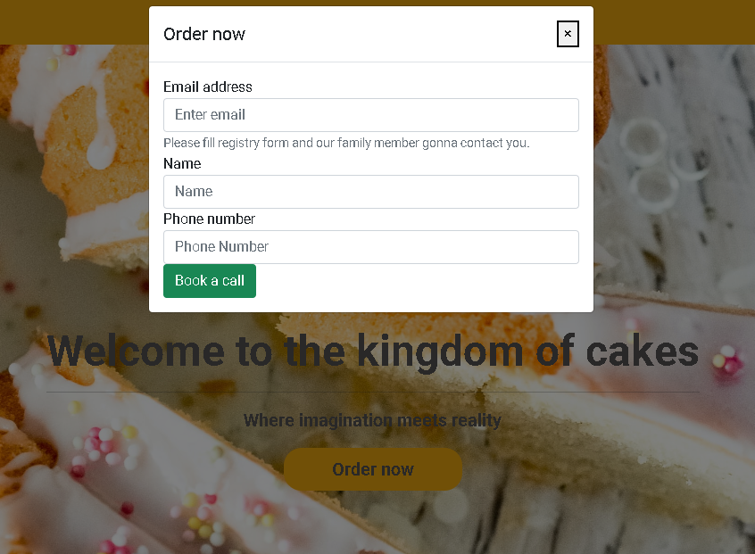
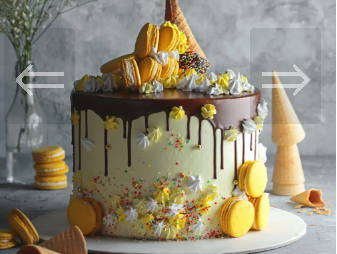

# Welcome to my first web page "Delicious Cakes"

## Milestone Project 1 - Static Front-End Website

###  I have created this web page as a part of  my Milestone Project 1 submission. All names and addreses are not real.
 

## Live Project

[My live project](https://edgarklavins.github.io/DeliciousCakes/)
 

## Repository
[My repository](https://github.com/EdgarKlavins/DeliciousCakes)

# Technologies Used

## Languages used
<ul>
<li>HTML5</li>
<li>CSS3</li>
</ul>

## Frameworks, Libraries & Programs Used

<ul>
<li><strong>Bootstrap 5.0.2</strong></li>
(Bootstrap was used to assist with the responsiveness and styling of the website.)
<li><strong>Hover.css</strong></li>
(Hover was used for navigation bar and jambotron elements)
<li><strong>Google Fonts</strong></li>
Google fonts were used to import the 'Roboto' font into the style.css file which is used on all pages throughout the project.
<li><strong>Font Awesome</strong></li>
Font Awesome was used on all pages throughout the website to add icons for aesthetic and UX purposes.
<li><strong>jQuery</strong></li>
Query came with Bootstrap to make the navbar responsive but was also used for the smooth scroll function in JavaScript.
<li><strong>Git</strong></li>
Git was used for version control by utilizing the Gitpod terminal to commit to Git and Push to GitHub.
<li><strong>Github</strong></li>
GitHub is used to store the projects code after being pushed from Git.
<li><strong>Photoshop</strong></li>
Photoshop was used for resizing images and editing photos for the website.

</ul>
 

# User stories

Potential users for this website are busy individuals, who do not have time to stop at the bakery and first time buyers who have found our website by using search engines or ads.

### Visitors
<ul>
<li> As a potential customer, I would like to have a quick access to order and contact the company. 
<li> As a potential customer, I would like to see information about company and its history.
<li> As a potential customer, I would like to see some images of cakes to determine the quality and skill of bakers.
<li> As a potential customer, I would like to see links to social media

</ul>

 

### Business Owners
<ul>
<li> As a bussines owner, I want my website to to be accessible and fully functional on all platforms
<li> As a bussines owner, I want my website to offer quick access to order.
<li> as a bussines owner, I want my website to give access to our social media, so visitors can follow us.
</ul>

 

# Design

## Structure

My website has a Homepage and 3 further pages; About, Cakes and Gallery.
<ul>
<li>Homepage - the main page providing most vital information and links to other pages</li>
<li>About - provided brief history of the company, management and locations</li>
<li>Cakes - provided information about cakes and cake types bakery is specialised in</li>
<li>Gallery - provides carousel type images of different cake types for different ocassions</li>
</ul>
 

## Wireframes 

<ul>
<li>  <a href="assets/Wireframes/Home.pdf">Home</a>
<li>  <a href="assets/Wireframes/About.pdf">About</a>
<li>  <a href="assets/Wireframes/Cakes.pdf">Cakes</a>
<li>  <a href="assets/Wireframes/Gallery.pdf">Gallery</a>

 

### Navigation Bar
 

 

 
<ul>
<li> The Navigation bar appears as a horizontal list on desktop, and a vertical drop down menu on mobile.
<li> Navigation bar is sticky
<li> From gallery page,  there is only option to return to Home
</ul>
 
 
 

### Main page/Jumbotron
 

<ul>
<li>In the middle, Home page contains Jumbotron button, which will allow customers to input most necessary information to order
<li> Main page contains heading and inspirational slogan</li>
</ul>

 

### Footer
 

<ul>
<li>The Footer includes Social media links and thanks for visiting us message
<li>Footer in gallery page is decreased to improve image viewing experience

 

### Gallery
 

<ul>
<li>Gallery contains 12 images of 3 different types of cakes
</li>
<li>To increase image loading speed, I have used carousel (Following my instructors advice)
</ul>
 
 

### Colour Scheme
The two main colours used are orange rgb(226, 159, 14) and grey #525050 

### Typography
The Roboto font is the main font used throughout the whole website with Sans Serif as the fallback font in case for any reason the font isn't being imported into the site correctly.
### Imagery
Imagery is important. The large, background hero image is designed to be striking and catch the user's attention. It also has a modern and energetic 

Most of images are takken from 
Unsplash: https://unsplash.com
 
 

# Testing

### W3C CSS Validator
 

    

 

 

### W3C HTML Validator

#### Home page

 

#### Gallery

 

### Lighthouse

 

I used the Lighthouse reports in Google Developer Tools

Website has scored more than 90 points in: Performance, Seo and Accessibility.
Website scored 75 points in Best practices due to possible security threat (Bootstrap cdn link)

 

 

## Testing User Stories

<ul>
<li>As a potential customer, I would like to have a quick access to order and contact the company. 
<li>In the middle of the homepage there is a "Order Now" button, which will provide quick access to contact the company.</li>
</li>
 
<li>As a potential customer, I would like to see information about company and its history.
<li>Website have a sticky navigation bar where visitor can press "about" button or just scroll down and read breaf information about company.

 

<li>As a potential customer, I would like to see some images of cakes to determine the quality and skill of bakers
<li>Website contains gallery with 3 different types of cakes: wedding cakes, birthday cakes and sculpture cakes.

 

<li>As a potential customer, I would like to see links to social media
<li>Home page and gallery footers contain social media icons with links directing to 4 main social platforms,

 

<li> As a bussines owner, I want my website to to be accessible and fully functional on all platforms
<li> Website is responsive and have been tested on different screen sizes, also different internet browsers like: Google Chrome, Mozilla Firefox and Opera

</ul>

 

### Peer review

<ul>
<li> I have submitted my website for valuation and my instructor have pointed out certain errors like streched images in "About" page
and slow loading speed for images in gallery page.
<li>I had to remove some default bootsrap style classes, because I could not prioritise my style, even with !important command. After implementing carousel, user experience in gallery page has significanly improved.
 

# Deployment

## GitHub Pages
The project was deployed to GitHub Pages using the following steps...

<OL><li>Log in to GitHub and locate the GitHub Repository</li>
<li>At the top of the Repository (not top of page), locate the "Settings" Button on the menu.</li>

<li>Scroll down the Settings page until you locate the "GitHub Pages" Section.</li>
<li>Under "Source", click the dropdown called "None" and select "Master Branch".</li>
<li>The page will automatically refresh.</li>
<li>Scroll back down through the page to locate the now published site link in the "GitHub Pages" section.</li>
</OL>
 

## Forking the GitHub Repository
By forking the GitHub Repository we make a copy of the original repository on our GitHub account to view and/or make changes without affecting the original repository by using the following steps...
<ol>
<li>Log in to GitHub and locate the GitHub Repository</li>
<li>At the top of the Repository (not top of page) just above the "Settings" Button on the menu, locate the "Fork" Button.</li>
<li>You should now have a copy of the original repository in your GitHub account.</li></ol>

## Making a Local Clone
<ol><li>Log in to GitHub and locate the GitHub Repository</li>
<li>Under the repository name, click "Clone or download".</li>
<li>To clone the repository using HTTPS, under "Clone with HTTPS", copy the link.</li>
<li>Open Git Bash</li>
<li>Change the current working directory to the location where you want the cloned directory to be made.</li>
<li>Type git clone, and then paste the URL you copied in Step 3.</li>
 

> $ git clone https://github.com/YOUR-USERNAME/YOUR-REPOSITORY
<li>Press Enter. Your local clone will be created.</li>
 

> Cloning into `CI-Clone`...

> remote: Counting objects: 10, done.

> remote: Compressing objects: 100% (8/8), done.

> remove: Total 10 (delta 1), reused 10 (delta 1)

> Unpacking objects: 100% (10/10), done.

</ol>

 

## Acknowledgements

Thanks to Code institute and Bristol College for their support.